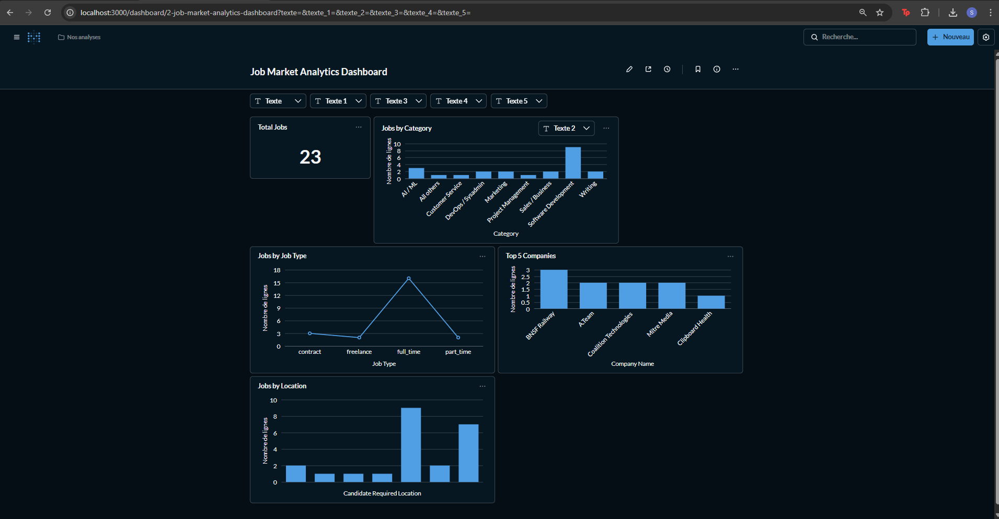
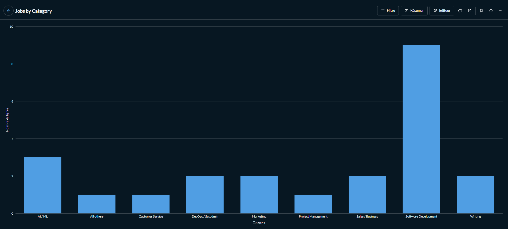

# 🚀 Job Market Data Pipeline & Analytics Dashboard

Production-style ETL pipeline that extracts remote job data from the Remotive API, transforms and cleans it, loads it into PostgreSQL, tracks pipeline runs, and visualizes insights with Metabase.

---
## 🧠 Engineering Concepts Demonstrated

- Incremental data loading
- Idempotent ETL runs
- Staging vs Production table architecture
- Pipeline observability (run tracking table)
- Docker container orchestration
- Data quality validation checks

## ✨ Features

### 🔄 ETL Pipeline (Python)

- Extract remote job listings from Remotive API
- Data transformation & cleaning (schema normalization, null handling, type casting)
- Incremental loading strategy:
  - `raw_jobs` → append-only staging table
  - `clean_jobs` → deduplicated production table (PRIMARY KEY on id)
- Data quality checks (null IDs, empty titles)
- Automatic CSV export (`data/jobs_cleaned.csv`)
- Structured logging (`logs/pipeline.log`)

---

### 📊 Monitoring

`pipeline_runs` table tracks:

- run_id
- start_time
- end_time
- duration
- rows_fetched
- raw_inserted
- clean_inserted
- status
- error_message

---

### 📈 Analytics Dashboard (Metabase)

- Total Jobs KPI
- Jobs by Category
- Jobs by Job Type
- Top 5 Companies
- Jobs by Location
- Dynamic filters (Category / Job Type)

---

## 🏗 Architecture

Remotive API  
⬇  
Python ETL (`src/pipeline.py`)  
⬇  
PostgreSQL (Docker container)  
⬇  
Metabase Dashboard  

---

## 🧰 Tech Stack

- Python (requests, pandas, SQLAlchemy, psycopg2)
- PostgreSQL
- Docker & Docker Compose
- Metabase
- Logging & Monitoring design

---

## 📷 Dashboard Preview

**Dashboard Overview**


**Jobs by Category**


**Top Companies**


---

## 📂 Project Structure

```text
job-market-pipeline/
├── src/
│   ├── pipeline.py
│   └── utils.py
├── data/
│   └── jobs_cleaned.csv
├── logs/
│   └── pipeline.log
├── docker-compose.yml
├── Dockerfile
├── requirements.txt
└── README.md


---

## ▶️ How to Run

Make sure Docker is installed.

```bash
docker compose up --build

Access:

PostgreSQL → localhost:5432
Metabase → http://localhost:3000


MEK
